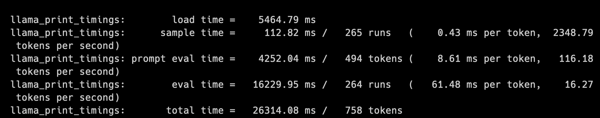
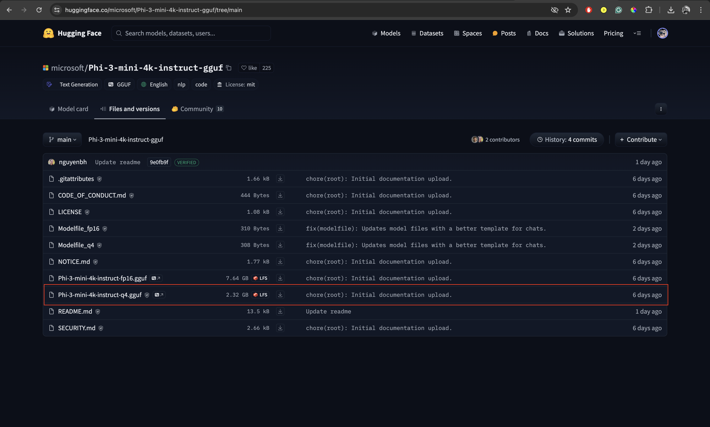
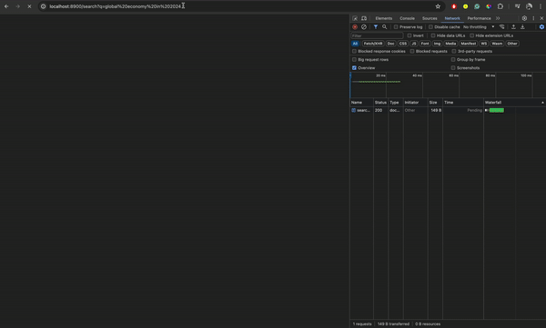
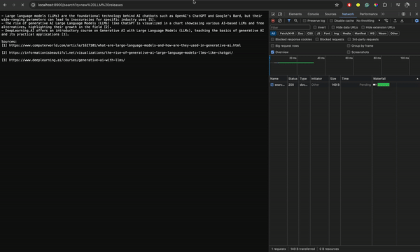
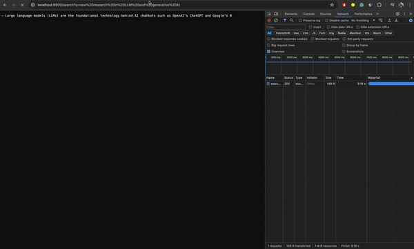

# llama-cpp-search

A local GenerativeAI powered search engine that utilizes the powers of `llama-cpp-python` for running LLMs on your local and enahances your search experience. The current version uses the **Phi-3-mini-4k-Instruct** model for summarizing the search.

## Performance

The Phi-3-mini models performs really well and the tokens per second is also very good. On my _M2 Macbook Air_ I'm getting a performance of around 16 to 20 tokens per second for generation. One thing I noticed is when stopping VS Code and other electron apps I got a performance boost of 27 to 29 tokens per seconds. Anyways both of those are decent for a local model.



> The performance entirely depends on your local machine. I you have a Nvidia GPU or a better M series PRO or MAX processor you might get better performance interms of tokens per second.

## Setup steps

Please follow the following steps to run this locally on your machine.

### Clone the repository

```sh
git clone https://github.com/vatsalsaglani/llama-cpp-search.git
```

### Install dependencies

```sh
pip install -r requirements.txt --no-cache-dir
```

### Create a `model` folder

Create a model folder inside the `local-cpp-search` folder so that we can download the model in that folder.

```sh
mkdir model
```

### Download the model

[Download the quantized Phi-3-mini-4k-Instruct model in GGUF format from HuggingFace](https://huggingface.co/microsoft/Phi-3-mini-4k-instruct-gguf/tree/main).



> Remember to move the model to the `model` folder.

### Environment variables

Add the Brave Search API key into the environment. Create a `.env` file and add your `BRAVE_API_KEY`

```
# .env
BRAVE_API_KEY="YOUR_API_KEY"
```

### Start the FastAPI server

```sh
python app.py
```

The server will expose the API endpoints for search and chat on `http://localhost:8900`.

The _chat_ endpoint will allow you to get chat completions.

The **_search_** endpoint will take a query and search it using the Brave Search API and provide a search summary.

## Demo

Let's look at a real-time demo.

> P.S.: You can check the network speeds for the time required to search and summarize it via the Phi-3 model locally. The video is not fast forwarded.

### Query: Global economy in 2024



### Query: LLM Releases



### Query: LLM Research

